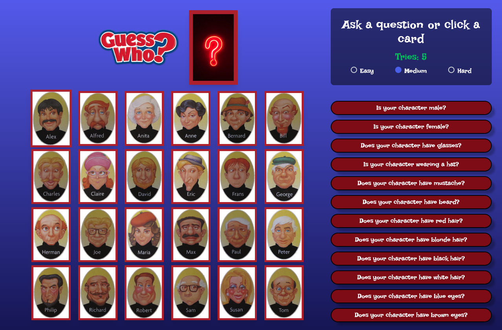
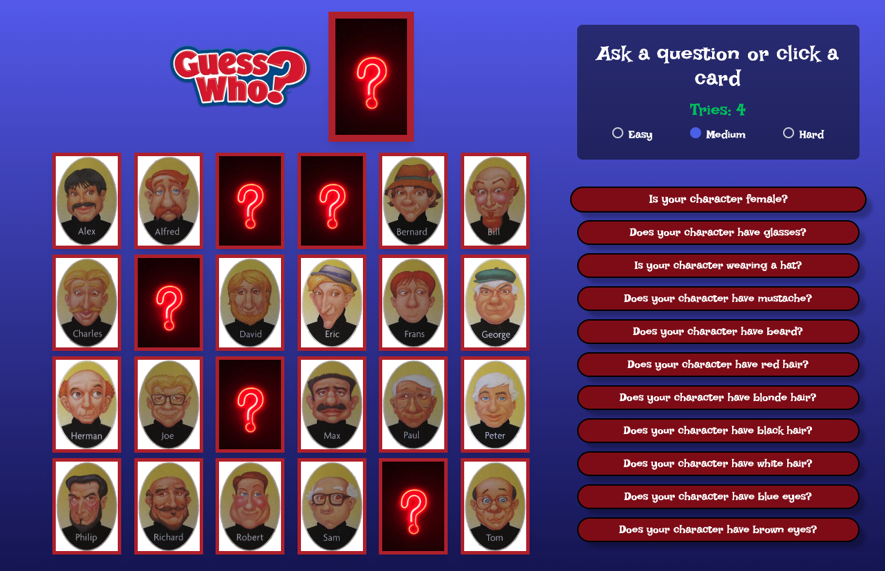
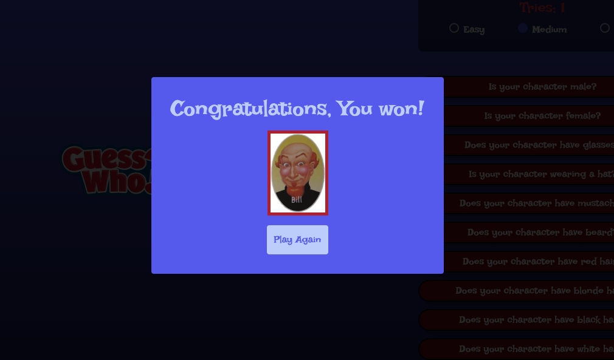

# 🎲 Guess Who | Gameboard

## 📌 About
A digital version of the classic **Guess Who?** board game, built as a portfolio project.  
This app was created with **React** and styled using **TailwindCSS**, with state management handled by the **React Context API**.  

---

## 🚀 Features
- Digital board game inspired by *Guess Who?*
- Interactive character selection
- State management with Context API
- Responsive design with TailwindCSS

---

## 🛠️ Stack
- **React (JavaScript)**
- **TailwindCSS**
- **Context API**

---

## 📷 Screenshots
  

---

## 🔗 Links
- **Live site:** [guesswho.freddyromo.dev](https://guesswho.freddyromo.dev/)  
- **Repository:** [GitHub Repo](https://github.com/FreddyRomoCH/Guess-Who-BoardGame)  

---

## 📄 License
This project is open source and available under the [MIT License](LICENSE).
